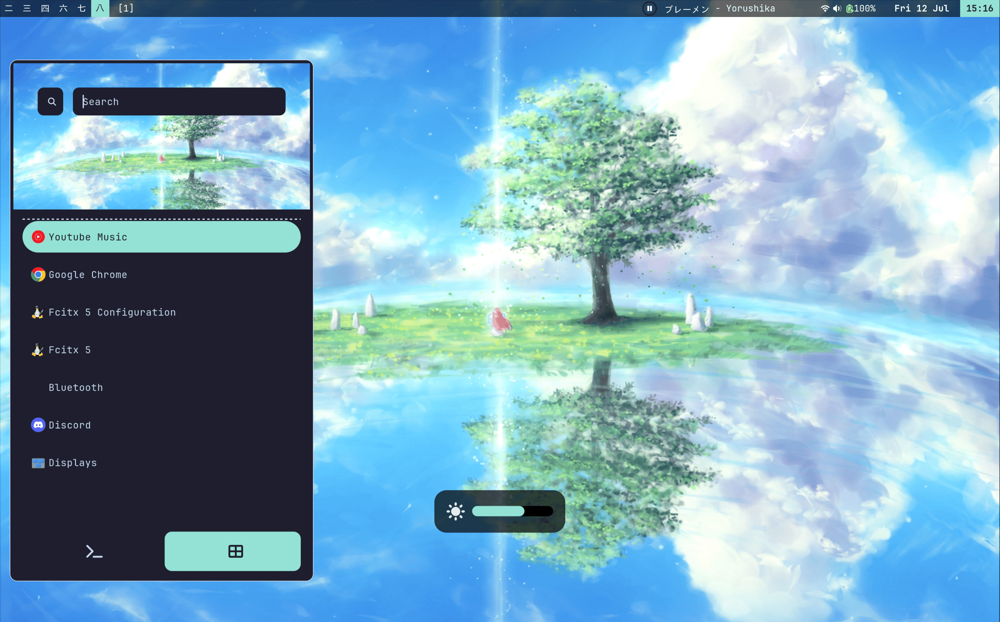

# Flake




## Tools

- WM: niri
- Widgets: astal + rofi (app picker + clipboard history picker)
- Lockscreen: hyprlock (+ hypridle for loginctl/auto suspend when locked)
- Lots of cli tools
- Impermanence (everything except `~/stuff` & `~/projects` is wiped on reboot), `/` is a tmpfs.

## Nvim

 - Is configured through lua
 - Plugins & LSP are configured in nix
 - Everything is binary compiled at build time
 - Everything is packed in a single plugin to optimize the runtimepath length
 - A `.luarc.json` can be generated using `nix develop`
 - The config can be used from anywhere using `nix run github:zoriya/flake#nvim`

## Install

Format disk with:
 - 200M efi part -> `mkfs.fat -F 32 -n boot /dev/sda1`
 - other as linux part (/nix) -> `mkfs.ext4 -n nix /dev/sda2`

```sh
nix-shell -p git go-task
git clone https://github.com/zoriya/flake
cd flake
sudo task install:host
```
