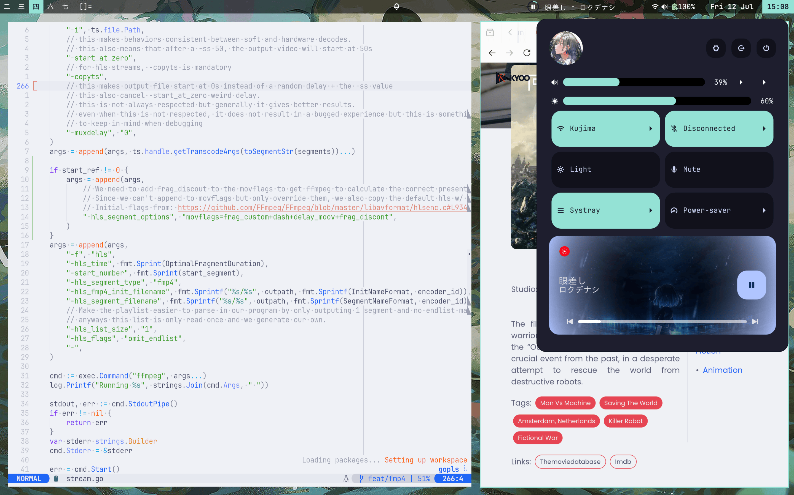
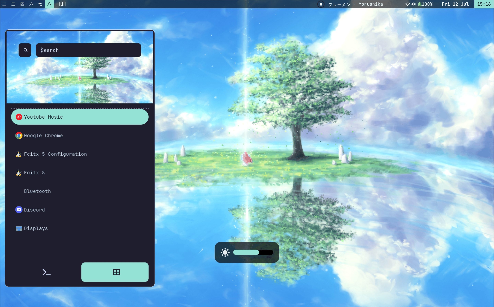

# Flake




## Tools

- WM: niri
- Widgets: noctalia (bar, launcher, clipboard history, lockscreen, idle) + rofi as the app picker
- Lots of cli tools
- Impermanence (everything except `~/stuff` & `~/projects` is wiped on reboot).

## Nvim

 - Is configured through lua
 - Plugins & LSP are configured in nix
 - Everything is binary compiled at build time
 - Everything is packed in a single plugin to optimize the runtimepath length
 - A `.luarc.json` can be generated using `nix develop`
 - The config can be used from anywhere using `nix run github:zoriya/flake#nvim`

## Install

Format disk with:
 - 200M efi part -> `mkfs.fat -F 32 -n boot /dev/sda1`
 - other as linux part, GPT name `crypt`.

```sh
cryptsetup luksFormat --type luks2 /dev/sda2
cryptsetup open /dev/sda2 crypt
mkfs.btrfs -L nix /dev/mapper/crypt
```

```sh
nix-shell -p jujutsu go-task
jj git clone https://github.com/zoriya/flake
cd flake
sudo task btrfs
sudo task install:host
```

## Secure boot

Keys are created on the first boot and staged on the esp. To let the firmware
pick them up, set `Secure Boot Mode` to `Custom` and `Factory Key Provision` to
`Disabled` in the bios, then `Reset To Setup Mode`: systemd-boot enrolls them on
the next boot and reboots on its own. Then to auto-unlock luks:

```sh
sudo systemd-cryptenroll --tpm2-device=auto --tpm2-pcrs=7 /dev/disk/by-partlabel/crypt
```
