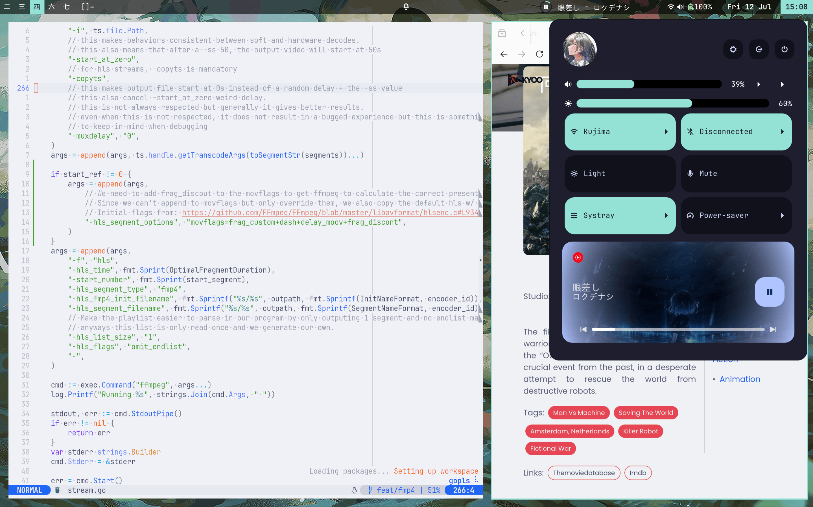

# Flake

## Tools

- WM: river + luatile
- Widgets: ags (+ astal for river integration) + rofi (app picker + clipboard history picker)
- Lockscreen: hyprlock (+ hypridle for loginctl/auto suspend when locked)
- Lots of cli tools
- Impermanence (everything except `~/stuff` & `~/projects` is wiped on reboot), `/` is a tmpfs.

## Notes for myself

`mkdir -p /nix/persist/home` (else persisted seems to be bugged)

`nix-shell --run 'mkpasswd -m SHA-512' -p mkpasswd` to generate a password
